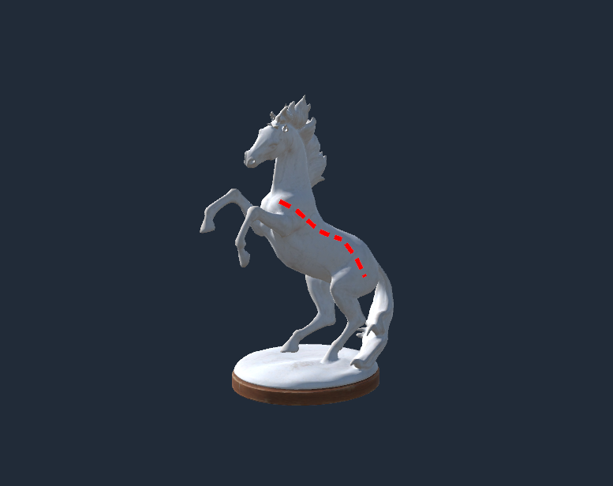

# Surface Dash Lab

A Unity 2022 project for authoring and rendering dashed lines on a 3D collider. Control points are placed in the Scene view, projected onto the model, and converted into evenly spaced dashes at runtime.

## Requirements

- Unity **2022.3.62f3** (the version saved in `ProjectSettings/ProjectVersion.txt`).
- The built-in render pipeline, which this project currently uses.
- The CC0 horse model is included in the repository.

Open this directory as a project in Unity Hub. Unity will import the assets and the embedded `com.coplaydev.unity-mcp` package on first launch.

## Scene

`Assets/Scenes/HorseSurfaceLine.unity` is the project's only scene and the only enabled build scene. The red dashes follow the CC0 horse statue's surface. Click a dash in Play mode to hide it.

## Build

Open **File > Build Settings**, select **Windows, Mac, Linux**, and build the enabled scenes. The saved target is Windows 64-bit. A local Windows build has been checked successfully; build output is intentionally ignored by Git.

Unity may warn that the project is not linked to Unity Services. The scene does not use Unity Services, so no project ID is required to run it.

## Author a 3D dashed line

1. Open `HorseSurfaceLine` and select **3D Dashed Line** under **CC0 Horse Statue** in the Hierarchy.
2. In its `Dashed Surface Line` inspector, assign the target collider if you are using another model.
3. Click **Draw Points in Scene** and click the model, or click **Add 3D Point**. Use **Finish Drawing** when done.
4. Select a yellow point handle to move it in 3D. The green marker shows where that point projects onto the collider. A red warning means it is outside the projection range.
5. Set **Projection Mode**, **Projection Direction**, and **Projection Distance** for the model. Use **Use Scene View Direction for Projection** when a directional projection should follow the current view.
6. Set **Dash Length**, **Gap Length**, **Width**, and **Dash Capacity**. The inspector warns if the path needs more dashes than the reserved capacity.
7. Enter Play mode. The line rebuilds from the saved control points; click close to a visible dash to hide it. **Click Tolerance** sets the maximum click distance in world units.

Points are serialized in the target collider's local coordinates. The editor can copy or paste one `x;y;z` point per line, or copy a C# `Vector3` array. Control points do not need equal spacing: dash placement uses distance accumulated along the sampled, projected path.

## How it works

`DashedSurfaceLine` samples between control points, projects each sample with a collider raycast, and places dashes along the resulting 3D path. Its mesh reserves two triangles per dash. Removing a dash updates only four vertex alpha values; the index buffer and mesh capacity stay fixed. The shader culls back faces and renders the line above the target surface.

See [Technical notes](Docs/TECHNICAL.md) for projection modes, rendering behavior, and limits.

## MCP for Unity

The project includes an embedded copy of [MCP for Unity](https://github.com/CoplayDev/unity-mcp) v10.0.0. The package is optional for running the scene. To connect an MCP client on another machine, open **Window > MCP for Unity** in the editor and follow the package's setup wizard. Its local server requires Python and `uv` or `uvx`; see the [upstream setup guide](https://github.com/CoplayDev/unity-mcp).

## Repository contents and rights

Unity's generated `Library`, `Temp`, `Logs`, `UserSettings`, IDE files, and captures are ignored by Git. The scene uses the included CC0 [Horse Statue 01](https://polyhaven.com/a/horse_statue_01) by Rico Cilliers.

The project-owned code and assets have **no public license yet**. The horse model and embedded MCP package keep their separate licenses. See [Third-party notices](Docs/THIRD_PARTY.md).
